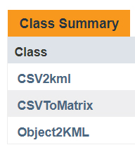
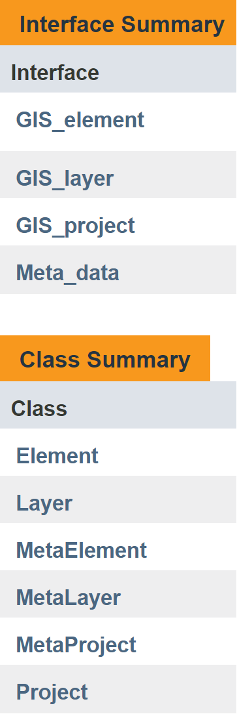
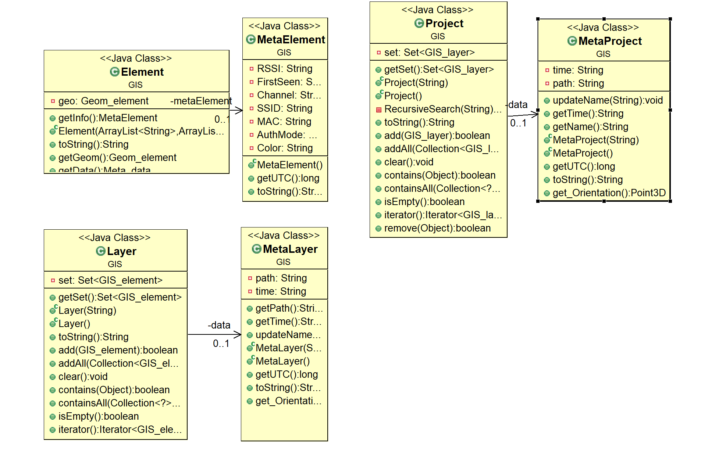

<h1>OOP Ex2</h1>  
 Created during a computer communication course during the second year at Ariel University 
  
 in the Department of Computer Science, 2018
<h3>Project site: <a href="https://zvimints.github.io/OOP_2/">https://zvimints.github.io/OOP_2/</a></h3>
<h1>About the program</h1>
This project can convert CSV files into Objects such as project,layer, and elements.
in Addition we can represent any point in 3D space and perform vector operations on it and more.
The program includes the next packages:
 

 
<h1>Algorithms</h1>
  
The Algorithms package is include MultiCSV class, that responsible to convert Multi CSV files
into a KML file

 
<h1>Coords</h1>
The Coords package is include the next Classes:
  
<list>
<li>MyCoords: Class that responsible to coords calculation, for example we can make
add, calculate distance3d, distance2d, make vector from two 3DPoints, calculate Azimuth,Elevation and Dist
between two 3D Points, and check if a input 3D Point is a Valid GPS Point.</li>
<li> coords_converter: a interface that MyCoords class implements</li>
</list>

 
<h1>File_format</h1>
The File_format package is include the next Classes:
  
<list>
<li>CSV2KML:  get .CSV file as input, and transform it into a .KML file</li>
<li>CSVToMatrix: get .CSV file as input, and transform it into a Matrix, we can take every cell in .CSV file in O(1)</li>
<li>MatrixToLayer: gets Matrix that represent .CSV file and convert it into Layer, each Layer contain Elements that  represent a line in Matrix</li>
<li>Layer2KML: gets Layer that represent .CSV file and convert it into valid .KML file<li>
<li>Project2KML: gets Project that represent a Set of Layers and make a .KML file that represent all layers that are in the Set</li>
</list>

 
<h1>Geom</h1>
The Geom package is include the next Classes:
  
<list>
<li>Geom_element:  an interface that represent a Geom element</li>
<li>Point3D: a 3D Point that implements Geom_element</li>
</list>

 
<h1>GIS</h1>
The GIS package is include the next Classes:
  
<h1>GIS Class Diagram:</h1>
  
<list>
<li>Meta_data:  an interface that represent data about point</li>
<li>Data: class that implements Meta_data, have information about a Point</li>
<li>GIS_element:  an interface that represent a Element, each Geom element have Geom element and Meta_data</li>
<li>Element: class that implements GIS_element, have Geom element and Data, each Point is an element</li>
<li>GIS_layer:  an interface that represent a set of GIS_element</li>
<li>Layer: class that represent a Set of elements, for example one .CSV file</li>
For example, a Layer in KML file:
  
<li>GIS_project:   an interface that represent a set of GIS_layer</li>
<li>Project:  class that represent a Set of Layers, for example Folder of .CSV files</li>
For example, a Project in KML file:
  
</list>

<h1>Junit Testing</h1>
The Testing package is include the next Classes:
  
<list>
<li>Csv2kml Junit Test: Test CSV2kml class</li>
<li>MultiCSV Junit Test: Test MultiCSV class</li>
<li>MyCoords Junit Test: Test MyCoords class</li>
</list>

